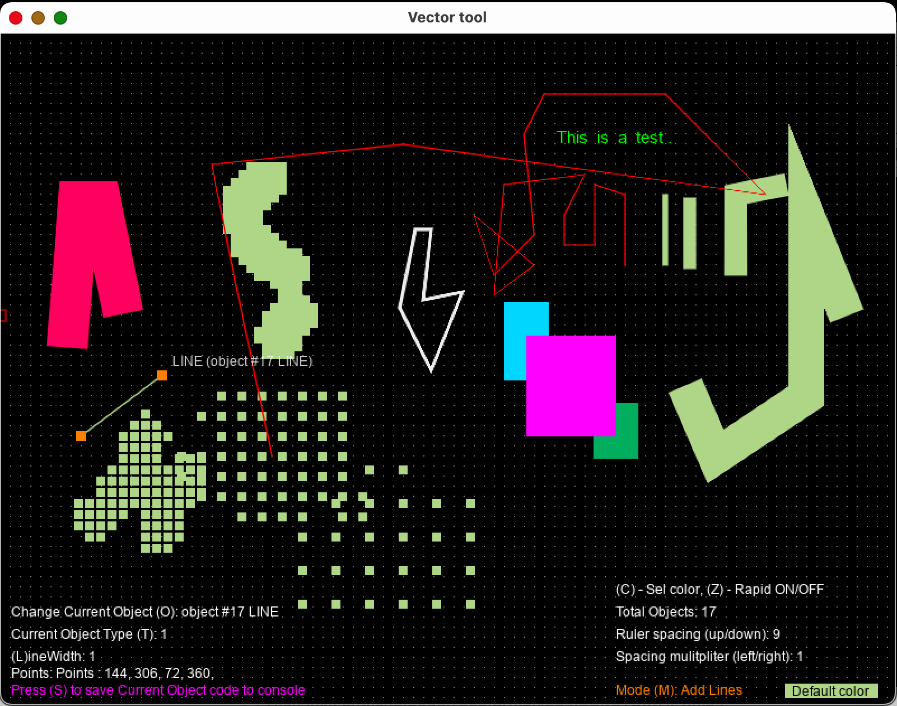
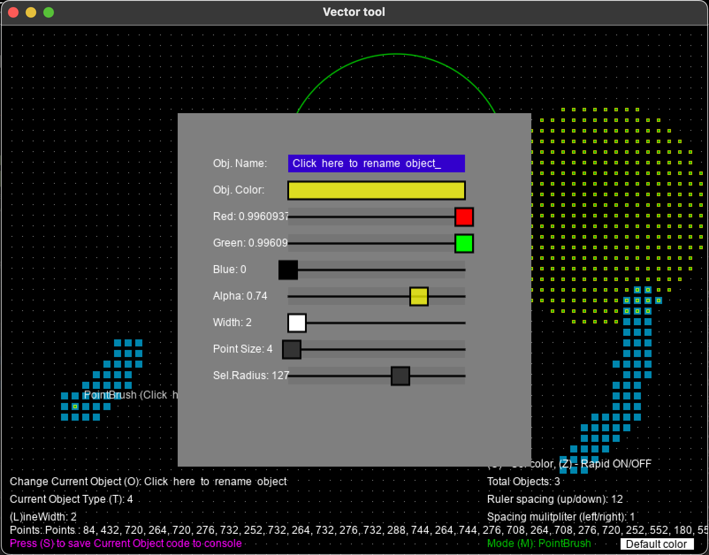
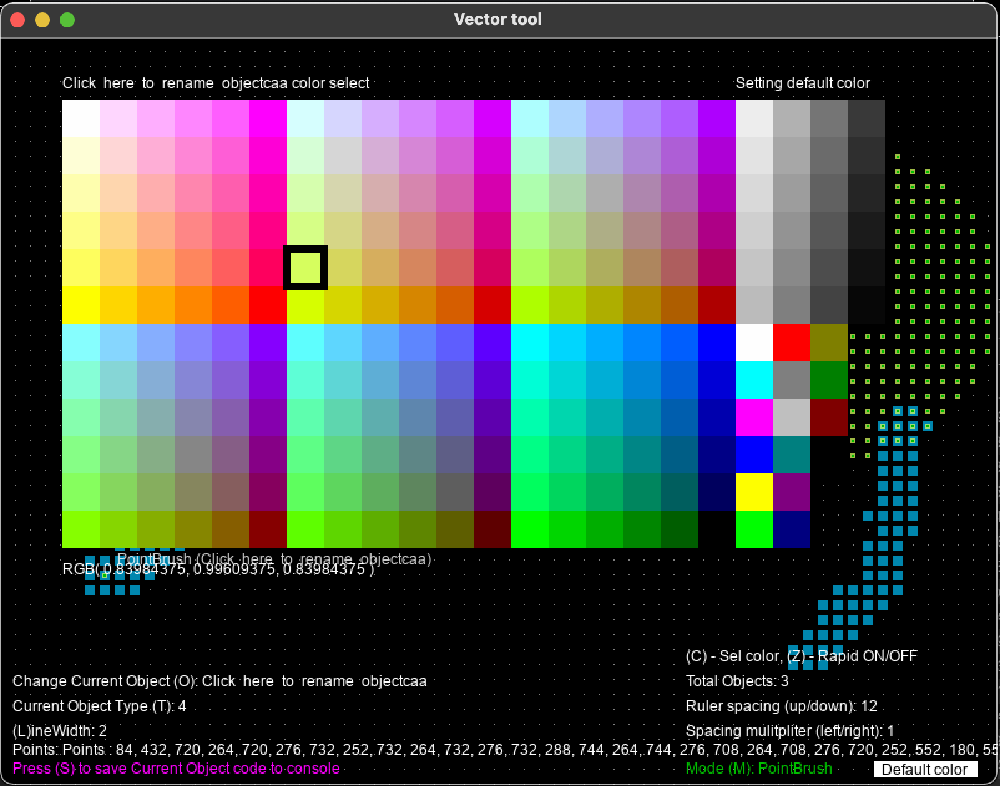

# vector.love

This is a vector tool initially written as a way to export vector point data as Love2D code for other games. You can run the tool the same as any.love project. Download <a href="https://love2d.org/">Love2D</a> and then drag the vector.love folder onto the love application. 

The controls use specific shortcut keys. "a" will edit an objects attributes, name, color, etc.. 

"m" changes the modes between the add line, move, add rect, add text and the point brush. The grid size is adjusted with the arrow keys. 

To export an object's code and point data press the "s" key. This feature requires starting the vector.love project through a terminal window. 

Use shift-click to start a new line or point brush object. Cycle through all objects with "o". 

Rectangles can be toggled fill/line with the "f" key.

Vector segments can be deleted with "d". Rapid delete mode "z" is useful for deleting points quickly in point brush objects. 

Hold "c" for a quick color picker.

